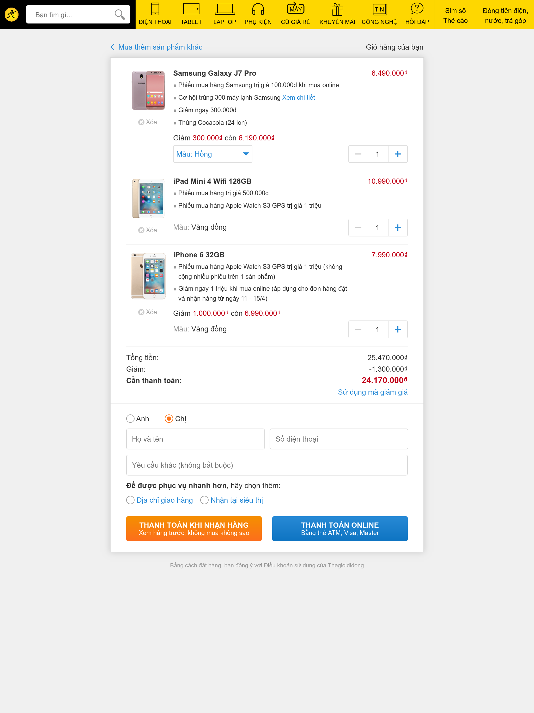

# TẬP CLONE SHOPPING CART FORM CỦA THẾ GIỚI DI ĐỘNG

## Requirments & Progress

- [x] Giữ đúng responsive layout (chế độ điện thoại và máy tính)
- [ ] Đảm bảo các tính năng chính
    - [x] Nhấn nút thêm bớt số lượng, sẽ thay đổi tổng tiền cần thanh toán
    - [x] Xóa item bằng nút xóa. Ghi chú: Vẫn đang bị 1 lõi chưa khắc phục được
    - [ ] Click vào "Sử dụng mã giảm giá" sẽ mở ra ô để nhập mã (dạng accordion)
        - [ ] Nút "Áp dụng" sẽ đưa ra cảnh báo "Bạn cần nhập số điện thoại" khi field *Số điện thoại* chưa được điền
        - [ ] Hiện thông báo bên dưới nút "Áp dụng": 
                - Màu xanh lá cânh "Mã giảm giá áp dụng thành công"
                - Màu đỏ "Rất tiếc mã giảm giá không áp dụng được"
    - [ ] Click vào "Điạ chỉ giao hàng" sẽ mở ra ô để chọn và điền Thành phố, Quận, Huyện, tên Đường, số nhà
    - [ ] CLick vào "Nhận tại siêu thị" sẽ mở ra các ô chọn siêu thị gần nhất    

## Notes

### Lỗi gặp phải:

- 2018.04.15: Giải quyết vấn đề với việc tăng, giảm số lượng items. Phát hiện ra là do không để ý đến vấn đề "hoisting" trong JavaScript, để code tuần tự từ trên xuống. Không nhớ chính xác code cũ để minh họa ở đây.
- 2018.04.16: Giải quyết issue "[Nhấn nút xóa không có tác dụng](https://github.com/ngminhtrung/react-form-shopping-cart/issues/1")

